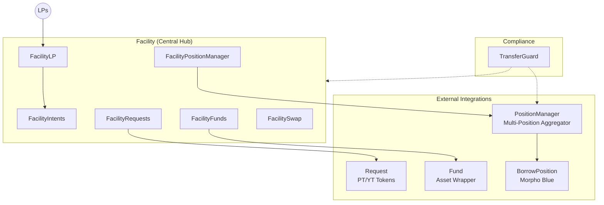

<p align="center">
  
</p>

**grunt** is the core contract suite of the 3F Protocol: it coordinates LP deposits into configurable funding **intents**, deploys the proceeds into wrapped external assets (Superstate, Centrifuge, Pareto, Midas) and leveraged Morpho Blue positions, and settles everything back to LPs through a strict intent lifecycle. Bridge loans between funding legs are tokenized as dual PT/YT claims.

## Repository Structure

```
src/
├── facility/                    # Core orchestration hub
│   ├── Facility.sol             # Main entry point combining all modules
│   ├── IntentDescriptor.sol     # ERC-6909 metadata provider
│   └── base/                    # Intent lifecycle, LP ops, fund/request/PM coordination, swaps, roles
├── request/                     # Dual-token PT/YT bridge-loan system
│   ├── Request.sol              # Main request contract
│   ├── RequestFactory.sol       # Beacon proxy factory
│   ├── Vault.sol                # ERC4626-style redemption vault
│   └── abstract/                # Base contracts and token controllers
├── manager/                     # Multi-position aggregator
│   ├── PositionManager.sol      # ERC20-share vault over borrow positions
│   ├── PositionManagerFactory.sol   # Beacon proxy factory
│   ├── base/                    # Admin, fees, shares, rebalancing
│   └── rebalancer/              # Flash-loan rebalancer + LTV retargetting orchestrator
├── funds/                       # External asset wrappers (order state machine)
│   ├── USCC/                    # Superstate USCC integration
│   ├── centrifuge/              # Centrifuge ERC-7540 integration
│   ├── pareto/                  # Pareto (Idle Finance) CDO integration
│   ├── midas/                   # Midas mToken integration
│   └── WrappedAsset.sol         # Wrapper token (wUSCC, wmGLOBAL, ...) with virtual isAllowed hook
├── borrow/                      # Morpho Blue position wrapper + offer-based pre-liquidation
├── guard/                       # TransferGuard compliance controls
├── interfaces/                  # All interface definitions
└── libs/                        # Shared libraries (storage, intent, orders, shares math)
```

## Architecture

The protocol consists of interconnected modules orchestrated through the **Facility** contract:



An intent moves through three phases: **DEPOSITING** (LPs deposit against a cap), **RESOLVING** (the facilitator deploys funds through the attached fund/request/position-manager), and **RESOLVED** (LPs claim their proportional share of everything the intent holds).

## Documentation

Detailed documentation lives in [`docs/`](docs/README.md):

| Page | Contents |
|------|----------|
| [Architecture](docs/architecture.md) | Roles across contracts, deployment wiring, intent state transitions, access-control reference |
| [Facility](docs/facility.md) | Intent structure and lifecycle, LP operations, facilitator operations |
| [Request](docs/request.md) | PT/YT dual-token model, redemption formula, funding methods, nonce management |
| [Funds](docs/funds.md) | Order state machine and the USCC, Centrifuge, Pareto, and Midas integrations |
| [Position Manager](docs/position-manager.md) | Share accounting, deposit/withdraw/burn flows, rebalancing, fee mechanism |
| [Borrow](docs/borrow.md) | MorphoBorrowPosition, custom LLTV, proportional pre-liquidation, liquidation offers |
| [Retargetter](docs/retargetter.md) | LTV retargetting orchestration and the quoter math derivations |
| [Transfer Guard](docs/transfer-guard.md) | Token modes, address statuses, collateral allowlist delegation |
| [Deployment & Operations](docs/deployment.md) | Factory pattern, post-deployment wiring checklists, upgrade cautions |
| [Known Issues & Assumptions](docs/known-issues.md) | Accepted risks, unsupported cases, and operating assumptions from the audits |

## Development

Built with [Foundry](https://getfoundry.sh/) (Solidity 0.8.34):

```bash
forge build
forge test                        # excludes invariant and fork tests
FOUNDRY_PROFILE=full forge test   # includes invariant tests
```

## Audits

| Report | Date |
|--------|------|
| [ChainSecurity - Grunt](audits/ChainSecurity_3F_Grunt_Audit_2026-04.pdf) | April 2026 |
| [ChainSecurity - Grunt Funds](audits/ChainSecurity_3F_GruntFunds_Audit_2026-04.pdf) | April 2026 |
| [Cantina - Grunt](audits/Cantina_3F_Grunt_Audit_2026-05.pdf) | May 2026 |
| [Cantina - Fee Review](audits/Cantina_3F_Grunt_FeeReview_2026-05-27.pdf) | May 2026 |

Accepted risks and documented limitations from these reviews are consolidated in [Known Issues & Assumptions](docs/known-issues.md).

## License

BUSL-1.1, see [LICENCE](LICENCE).
