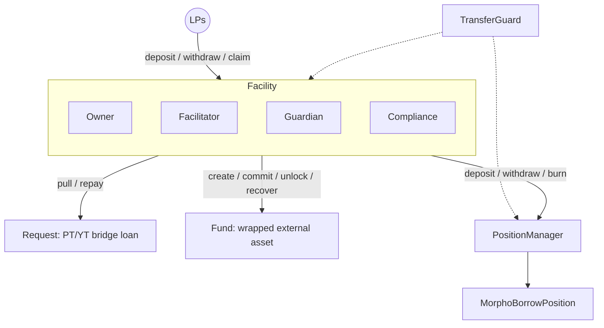

# Architecture

grunt is organized around the **Facility**, which orchestrates every other module. LPs deposit into intents on the Facility; the facilitator then deploys that capital through an attached **Fund** (wrapped external assets), **Request** (PT/YT bridge loans), or **PositionManager** (leveraged Morpho Blue positions), and LPs claim the proceeds once the intent resolves. A **TransferGuard** can sit on top of any of these tokens for compliance control.

Deployment notes:
- Multiple funds and requests can be attached to one Facility (one per intent), and multiple intents can share the same PositionManager.
- Each fund should serve a single intent; funds hold no per-intent accounting, so sharing one across intents mixes their balances.
- The intent lifecycle (DEPOSITING, RESOLVING, RESOLVED) and the per-function access rules are documented in [Facility](facility.md).

## Roles

Every contract uses `OwnableRoles`-style access control. This table is the canonical reference for who holds what in a typical deployment; the module pages describe what each operation does.

| Contract | Role | Typical Holder | Permissions |
|----------|------|----------------|-------------|
| **Facility** | Owner | Protocol Admin | Create intents, update target asset, set descriptor |
| | Facilitator | Operations Bot | Create intents, lock, resolve, set caps, set fund/request, all fund/request/PM/swap operations |
| | Guardian | Signers (EOA) | Sign swap authorizations (multi-sig for quorum) |
| | Compliance | Emergency Admin / Compliance Bot | Pause/unpause facility, revert deposits |
| **Request** | Owner | Protocol Admin | Mark loan as repaid, authorize minting |
| | Puller | Facility | Pull bridge loan funds, repay funds |
| | Consumer | Protocol Admin | Consume signed offers, authorize minting |
| **USCCFund** | Depositor | Facility | Create/cancel/commit/unlock/recover orders |
| | Operator | Operations Bot | Settle fund state after external operations |
| **CentrifugeFund** | Owner / Operator | Protocol Admin / Operations Bot | Cancel vault requests via `cancelRequest()` |
| | Depositor | Facility | Create/cancel/commit/unlock/recover orders |
| **ParetoFund** | Owner / Operator | Protocol Admin / Operations Bot | Resolve stuck orders |
| | Depositor | Facility | Create/cancel/commit/unlock orders |
| **MidasFund** | Owner | Protocol Admin | Fallback for the operator, payment, and vault-manager roles below |
| | Operator | Operations Bot | Resolve stuck orders, flag/cancel recovery, set referrer and mToken/USD oracle |
| | Payment | Operations EOA | Confirm bond receipts via `unlockInstantRedeem()` |
| | Vault Manager | Operations EOA | Set deposit and redemption vaults, manage the bond config |
| | Depositor | Facility | Create/cancel/commit/unlock/recover orders |
| **PositionManager** | Owner | Protocol Admin | Add modules, set target LTV, set fees |
| | Minter | Facility | Deposit, withdraw, burn shares |
| | Curator | Operations Bot | Set supply/withdrawal queues |
| | Rebalancer | Rebalancer Contract | Execute rebalancing operations |
| **MorphoBorrowPosition** | Owner | PositionManager | All borrow/supply operations |
| **TransferGuard** | Owner | Protocol Admin | Set token config (mode, collateral check), grant roles |
| | Pauser | Emergency Admin | Pause/unpause tokens |
| | Compliance | Compliance Bot | Set address status (NONE/WHITELIST/BLOCKLIST/NATIVE) |

## Deployment and Upgrades

All long-lived contracts (Request, PositionManager, MorphoBorrowPosition, the funds, TransferGuard) are deployed as beacon proxies through their factories. Each factory owns an `UpgradeableBeacon`; the beacon owner upgrades every proxy at once by pointing the beacon at a new implementation. All proxied contracts use ERC-7201 namespaced storage to keep upgrades collision-free.

This is a deliberate trust decision: the beacon owner can change the behavior of every deployed instance. This and the other centralization assumptions (guard owner blocklisting, facilitator control over intent funds) are listed in [Known Issues & Assumptions](known-issues.md).

## Cross-Cutting Safeguards

- State-changing entry points use `ReentrancyGuardTransient`.
- Off-chain authorizations (funding offers, swap approvals, liquidation offers) are EIP-712 typed signatures.
- Rounding is conservative for the protocol throughout: debt rounds up, collateral and payouts round down.
