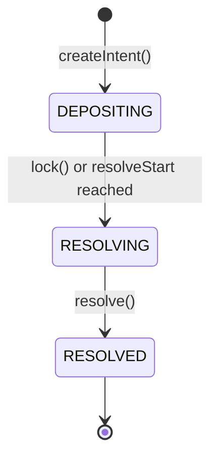

# Facility

The `Facility` manages **intents**: funding rounds that collect LP deposits, hand them to the facilitator to deploy, and settle the proceeds back to LPs. Each intent is identified by an id and tracks:

- **deposit asset**: what LPs pay in (can itself be a PositionManager)
- **target asset**: what fund operations produce (can be a PositionManager)
- **fund** (optional): wrapper for processing an external asset, see [Funds](funds.md)
- **request** (optional): PT/YT bridge-loan contract, see [Request](request.md)
- **guard key**: the PositionManager whose TransferGuard is consulted for compliance checks

LP balances are ERC-6909 tokens minted 1:1 against deposits.

## Lifecycle

An intent moves through three phases and never moves back:

**DEPOSITING**: anyone can `deposit` up to the deposit cap; LPs (or an operator) can `withdraw` 1:1. The facilitator can adjust the cap and attach a fund or request; the owner can update the target asset.

**RESOLVING**: entered by an explicit `lock()` or automatically once `resolveStart` passes. LP movement stops; the facilitator runs the actual funding: fund orders (`create`/`cancel`/`commit`/`unlock`/`recover`), request pulls and repayments, PositionManager deposits/withdrawals/burns, and guardian-signed swaps.

**RESOLVED**: entered by `resolve()`, which requires that no fund order is active and that the request (if one was attached) is marked repaid. LPs `claim` their proportional share of every token the intent holds; `claim` returns `(tokens[], amounts[])`.

## Access Control

All state-changing functions, their required role and phase:

| Function | Role | Phase | Additional checks |
|----------|------|-------|-------------------|
| `createIntent` | Owner/Facilitator | - | `resolveStart` in the future |
| `updateTarget` | Owner | DEPOSITING / RESOLVING | - |
| `setDepositCap` | Facilitator | DEPOSITING | - |
| `lock` | Facilitator | DEPOSITING | - |
| `setFund` | Facilitator | any | no active order |
| `setRequest` | Facilitator | any | previous request (if any) repaid |
| `resolve` | Facilitator | RESOLVING | no active order, request repaid |
| `deposit` | anyone | DEPOSITING | within deposit cap |
| `withdraw` | LP or operator | DEPOSITING | sufficient balance |
| `claim` | LP or operator | RESOLVED | sufficient balance |
| fund operations (`create`, `cancel`, `commit`, `unlock`, `recover`) | Facilitator | RESOLVING | fund set; order in the matching state |
| request operations (`pull`, `repay`) | Facilitator | RESOLVING | request set |
| `depositManager` / `withdrawManager` / `burnManager` | Facilitator | RESOLVING | asset is a PositionManager |
| `swap` | Facilitator | RESOLVING | guardian signatures meet quorum |
| `revertDeposit` | Owner/Compliance | not RESOLVED | deposit-asset balance covers supply (so it works into RESOLVING until deposits are consumed); only owner may redirect the receiver |
| `pauseFor` | Owner/Compliance | any | duration 0 unpauses |

`revertDeposit` force-exits a single LP (compliance tool): it burns their full LP balance and returns the deposit asset. `pauseFor` pauses all LP operations for a duration.

## Views

| Function | Returns |
|----------|---------|
| `intentBalances(id)` | every token the intent holds, as parallel `(tokens[], amounts[])` |
| `getIntent(id)` | the intent's properties and current phase |
| `totalSupply(id)` | LP token supply for the intent |
