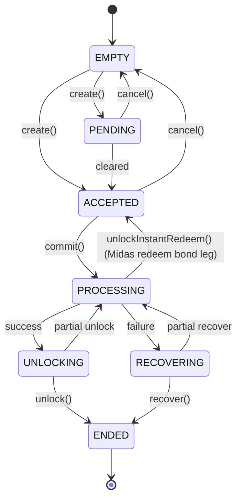

# Funds

A fund wraps one external asset (Superstate USCC, a Centrifuge vault share, a Pareto tranche, a Midas mToken) behind a common order interface, so the [Facility](facility.md) can drive every integration the same way. Output shares are `WrappedAsset` tokens (wUSCC, wmGLOBAL, ...) minted 1:1 against the underlying, with a virtual `isAllowed` hook for compliance.

A fund processes **one order at a time**. An order is either a DEPOSIT (asset in, wrapped shares out) or a REDEEM (wrapped shares in, asset out) and moves through a state machine driven by the depositor (the Facility):

`create()` registers the order, `commit()` moves the value into the external protocol, `unlock()` delivers the proceeds to the receiver, and `recover()` is the failure exit that returns whatever came back. The async integrations (Centrifuge, Pareto, Midas) store an internal state that can differ from what `state()` reports: `state()` also queries the external protocol to detect transitions that happen off-chain (for example a cleared epoch turning PROCESSING into UNLOCKING).

The integrations differ in how each step maps onto the external protocol:

| | USCC (Superstate) | Centrifuge (ERC-7540) | Pareto (Idle CDO) | Midas (mToken) |
|--|-------------------|----------------------|-------------------|----------------|
| Deposit | off-chain mint | async epoch | synchronous | async mint request |
| Redeem | off-chain settlement | async epoch | epoch-gated | two-leg bond + instant redeem |
| Partial fills | no | yes | no | no |
| Recovery | yes | via `cancelRequest()` | not supported | deposits and unsettled bonded redeems |

## USCC (Superstate)

Deposits transfer USDC to the Superstate recipient at `commit()`; once USCC is minted to the fund, `unlock()` wraps it into wUSCC for the receiver. Redeems burn wUSCC at `commit()` and trigger an off-chain redemption; `unlock()` releases the USDC when it settles, or `recover()` returns the USCC if it fails. An operator settles the fund state after these external operations.

## Centrifuge (ERC-7540)

Wraps a Centrifuge async vault; shares are WrappedAsset tokens over the vault's share token. All vault calls use `requestId = 0`, the Centrifuge convention for "the current request for this controller" (each controller has at most one active request).

- **Deposit**: `create()` validates slippage against the current exchange rate; `commit()` pulls assets, approves the vault, and calls `requestDeposit()`. After epoch processing, `unlock()` claims shares via `mint()`, wraps them, and sends them to the receiver.
- **Redeem**: `commit()` unwraps the WrappedAsset and calls `requestRedeem()`; after epoch processing, `unlock()` claims assets via `withdraw()`.
- **Partial fills**: Centrifuge processes requests across epochs, so `unlock()`/`recover()` can be called repeatedly, returning to PROCESSING between partial claims.
- **Recovery**: the owner or operator submits `cancelRequest()` to the vault; once Centrifuge processes the cancellation, `recover()` claims what came back.

## Pareto (Idle CDO)

Wraps an `IdleCDOEpochVariant` credit vault; shares are WrappedAsset tokens over the AA (senior) tranche.

- **Deposit**: synchronous. `create()` validates the Keyring wallet allowance; `commit()` calls `depositAA()`, which succeeds or reverts atomically; `unlock()` wraps the tranche tokens.
- **Redeem**: epoch-gated. `commit()` unwraps and calls `requestWithdraw()`; after the CDO epoch ends, `unlock()` calls `claimWithdrawRequest()` and delivers the assets.
- **No recovery**: `recover()` always reverts with `RecoverNotSupported()`. Deposits are atomic and withdrawals always complete after epoch processing, so there is no stuck intermediate state to recover from.
- `resolve()` lets the owner or operator override an order's input/output amounts when a PROCESSING order received different amounts than expected.

## Midas (mToken)

Wraps a Midas mToken (for example mGLOBAL) through a WrappedAsset such as wmGLOBAL, using a Midas issuance vault for deposits and a dedicated per-redemption Repay-and-Redeem vault for redeems. Pricing on the fund side uses a configurable 8-decimal AggregatorV3 mToken/USD oracle (rotatable via `setOracle()`); the payment asset is assumed to be worth exactly $1, and Midas vault feeds are not used.

**Deposit**: asynchronous. `create()` validates the expected output against the oracle; `commit()` transfers the payment token and calls `depositRequest()`; the order stays PROCESSING until a Midas vault admin approves the mint request; `unlock()` wraps the minted mToken.

**Redeem**: every redeem follows the Repay-and-Redeem bond flow and commits in two legs:

1. `create(REDEEM)` starts the order bond-locked and resets the stored redemption vault to `address(0)`.
2. First `commit()` (bond leg): burns the bond fraction of the shares (per `bondConfig`) and forwards the unwrapped mTokens to the bond recipient. An empty bond config zeroes the payment but the flow still runs.
3. Midas deploys the dedicated redemption vault once the bond is received; the vault manager points the fund at it via `setRedemptionVault()` (allowed mid-order; the vault carries no per-order state).
4. `unlockInstantRedeem()` (owner or payment role) confirms the bond receipt and re-arms the order. Called before any commit, it skips the bond leg entirely for redemptions where no bond is required.
5. Second `commit()` (redeem leg): settles the remainder instantly via `redeemInstant()`. The order's minimum output is enforced on-chain by the vault and re-checked by the fund against the received balance, since redeem outputs are not oracle-validated at create (the per-redemption vault does not exist yet).
6. A single terminal `unlock()` sweeps the full payment-token balance (possibly zero) to the receiver and ends the order.

Once the bond is paid, `cancel()` reverts: the bond would be forfeited on abandonment, so a stuck order either completes forward or is aborted through recovery. The bond config is set via `setBondConfig()`/`removeBondConfig()` between orders only, while the deposit vault can also only change between orders (the pending mint request is tracked on it).

**Recovery** covers deposits and unsettled bonded redeems; a settled redeem is never recoverable (it completes via the terminal `unlock()`).

- A recovering **deposit** waits for Midas to return the committed input off-band in the payment token (rejected requests are not refunded on-chain); `state()` reports PROCESSING until the refund covers the input, then `recover()` sweeps it to the receiver.
- An unsettled **bonded redeem** (bond paid, redemption not executed) is aborted unconditionally: the remainder shares never left the depositor, and the only amount possibly owed back is the bond, returned by Midas off-band in mTokens. `recover()` re-wraps that balance 1:1 into shares minted to the receiver, so the refund lands inside the Facility's intent accounting (which snapshots the share token on a redeem recover). It may finalize with zero when the bond stays forfeited.
- `cancelRecovering()` restores PROCESSING; for a bonded redeem this lands back in the bond phase, so `unlockInstantRedeem()` must be re-called to resume. Only cancel a redeem recovery while no bond refund has arrived: mTokens already received are not swept by the resumed order's completion, so once the refund is in, finalize via `recover()`.

When the Midas vault greenlist is enabled or the mToken is permissioned, the fund, the WrappedAsset, and the bond recipient must all be greenlisted for orders to proceed.
